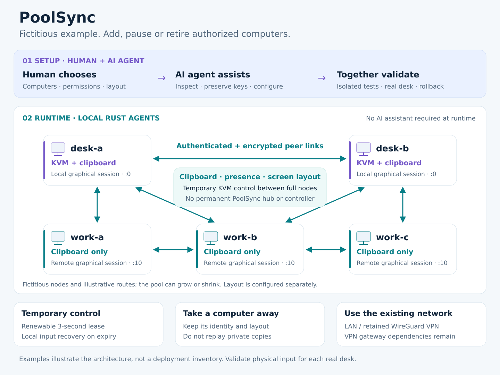

# PoolSync — One desk, many machines

## Start with a human–AI agent tandem

PoolSync is designed to be installed and configured by a human working with an
AI agent. The human chooses the pool, permissions and screen arrangement; the
AI agent assists with inspection, configuration, isolated qualification and
rollback. Physical input and monitor changes are validated at the actual desk.
Neither the AI assistant nor a PoolSync hub is required for normal peer operation.

## One-liner

**PoolSync connects Linux graphical sessions through encrypted peer exchanges:
shared text/images, with temporary keyboard/mouse control on authorized nodes.**

## An example desk (fictitious names)

| Computers | Role |
|-----------|------|
| desk-a and desk-b | KVM and clipboard; either can request temporary control. |
| work-a, work-b and work-c | Clipboard only in their participating graphical sessions. |

In this fictional layout, desk-a sits left of desk-b. The implemented edge
behavior lets desk-a target desk-b to the right and desk-b target desk-a to the
left. These roles and five names are an example, not a fixed pool size. Add an
authorized desk-c, take it away temporarily with its settings intact, or retire
another node through a reviewed configuration change. The example describes the
intended behavior. Physical
acceptance of the deployed full-mode nodes remains pending; the reported edge
blockage/loop stays open.

## How it works

- One Rust agent per user, attached to the selected graphical session.
- Authenticated, encrypted direct links carry clipboard, presence, layout and
  control; ordinary peers can relay over available routes.
- No permanently elected coordinator. Authorized full nodes request temporary
  input control; deterministic ordering resolves simultaneous claims.
- A renewable three-second control lease provides local expiry and recovery.
- Temporary departure preserves settings and avoids replaying private copies.
- The existing LAN/VPN supplies connectivity. Cross-site VPN gateway dependencies
  remain; removing the PoolSync hub does not remove the network infrastructure.

The legacy hub and its web dashboard remain in the repository for compatibility
and rollback. They are not required by the current hubless mode.

## RDP is a separate path

RDP delivers the remote display and keyboard/mouse. With the preserved clipboard
pause policy, a detected FreeRDP client keeps ownership of its native clipboard
channel; the remote session's PoolSync agent connects that session to the pool.
This avoids two clipboard owners competing and replaying older images. The
current detector does not directly cover Remmina or every RDP client.

Read [example computer and RDP scenarios](docs/CONCEPT-AND-SCENARIOS.md) for the
routes, detection limits, temporary departure and monitor cases.

## Evidence, not a blanket stability claim

The hubless development build is deployed on the five computers. Isolated DEV
qualification includes direct/relayed exchanges, faults, native paste receivers
and a finite twenty-minute image/text campaign. Physical crossings between the deployed full-mode computers,
local recovery and actual monitor attachment/removal remain acceptance gates.
See the [current deployment and qualification report](docs/HUBLESS-WINDOW-DEPLOYMENT-2026-10-03.md).

## Short share text

> PoolSync: one desk, several Linux computers. Encrypted peer clipboard and
> temporary keyboard/mouse control, without a permanent PoolSync hub. Installed
> and configured with a human–AI agent tandem; existing identities and settings
> are preserved. The daily-use development build is undergoing physical acceptance.
