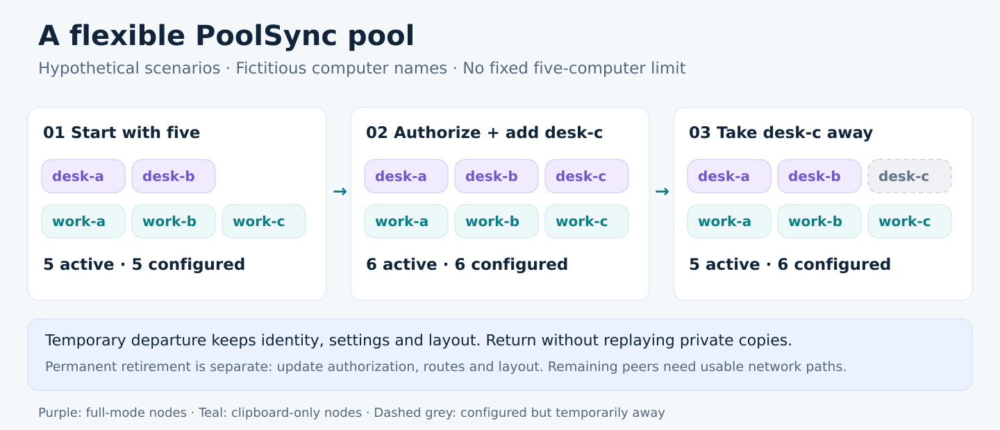
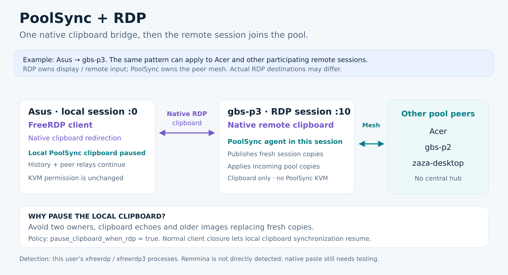

# PoolSync: human–AI setup, direct peer operation

## First: install and configure with a human–AI agent tandem

PoolSync is designed for installation and configuration by **a human working
with an AI agent**. The human defines which computers may join, which may
control keyboard/mouse, and how the screens are arranged. The AI agent helps
inventory sessions and network routes, preserve existing identities, keys and
settings, prepare isolated tests, configure the Rust agents and document a
reversible deployment. The human validates the real desk: physical input,
screen-edge crossings and monitor cables.

This is a setup and maintenance workflow. The AI assistant is not a permanent
PoolSync coordinator and is not needed for normal runtime operation. No extra
user password is introduced; the existing pool credentials remain necessary.

AI assistants should follow the
[build, installation and node configuration runbook](AI-AGENT-INSTALLATION.md).

The diagram illustrates logical peer connections, not an inventory of every
configured network route or the physical screen arrangement.

## Example computers (fictitious names)

All computer names below are fictional. This example illustrates two full-mode
computers and three clipboard-only computers; it is not a deployment inventory
or a limit on the number of members. Other names, roles, layouts and network
routes can be configured for an authorized pool.
A role applies to the agent's graphical session, not to every session a computer
might host.

| Computer | PoolSync role | Example graphical session | Why |
|----------|---------------|----------------------------|-----|
| desk-a | `full`: KVM + clipboard | Local X11, `:0` | Physical keyboard/mouse can request control and cross to desk-b. |
| desk-b | `full`: KVM + clipboard | Local X11, `:0` | Physical keyboard/mouse can request control and cross to desk-a. |
| work-a | `clipboard_only` | RDP/X11, `:10` | Share copies from the remote desktop without participating in edge KVM. |
| work-b | `clipboard_only` | RDP/X11, `:10` | Share a remote session's copies with the other peers. |
| work-c | `clipboard_only` | RDP/X11, `:10` | Share the session clipboard without KVM capture/injection. |

These displays are illustrative, not constants to hard-code
when a different session opens. An agent must attach to the intended user's
actual graphical session; a running process alone does not prove clipboard
access. Existing settings and saved positions should be preserved.

## Local network or multiple sites

**On the same local network, a VPN is not required.** For example, desk-a,
desk-b and work-a can exchange directly over their reachable LAN addresses.
Peer authorization and PoolSync encryption still apply; the local network
does not replace identities, keys or TLS configuration. Configure reachable
peer URLs and permit the intended connections between those computers.

**Across different networks or sites, a VPN is useful.** For example, desk-a
at the office and desk-c at home can use VPN addresses to establish private
peer routes across the Internet, including networks where direct reachability
would otherwise be unavailable. PoolSync needs connectivity between authorized
peers; it does not inherently require a particular VPN product.

An example pool can mix local LAN routes with VPN routes for distant peers.
A configured `peer_url_vpn` can provide a fallback for a peer's primary route.
The VPN supplies network reachability, not PoolSync coordination. If a chosen
VPN uses a common gateway, that gateway remains a network dependency for the
routes it provides. The recorded deployment deliberately retains its existing
VPN; this is a deployment choice, not a requirement for local-only pools.

## Hypothetical pool changes

These scenarios are deliberately hypothetical. They demonstrate configuration
choices and membership changes, not the exact current installation or proof
that every combination has already been qualified.

| Situation | Example change | What must happen |
|-----------|----------------|------------------|
| Add a workstation | A sixth computer, `desk-c`, joins as a full-mode node. | Give it its own identity, authorize reciprocal peers, configure reachable encrypted routes and add its screens to the reviewed layout. Qualify its physical input. |
| Add only a remote clipboard | `work-d` joins in an RDP graphical session. | Use `clipboard_only`; its agent shares copies without joining PoolSync KVM. RDP continues carrying its remote input. |
| Leave for the afternoon | Take `desk-c` out of the pool temporarily. | Use the tray departure action; keep its identity/settings/positions. Other peers communicate over remaining usable routes. |
| Return tomorrow | `desk-c` resumes participation. | Reuse its saved configuration; private copies made while away are not automatically broadcast. Check routes and screen geometry. |
| Retire a computer permanently | Remove `work-c` from the authorized pool. | Remove its authorization, peer routes and saved layout entry coherently. Stop/uninstall its agent as authorized; define any credential rotation needed by the retirement policy. This is a configuration operation, not the temporary-away toggle. |
| Change a role | A previously clipboard-only `work-a` should also handle KVM. | Explicitly change its permissions/mode and layout through reviewed configuration, then restart/requalify as needed. Physical activity alone never grants KVM permission. |
| Rearrange the desk | Put `desk-b` above `desk-a`, with a different resolution. | Update the shared layout; do not infer adjacency from IP addresses. Verify intended edges and real monitor behavior. |
| Use more or fewer peers | Begin with two computers, later configure several more. | Keep each member's identity and authorization distinct; review routes, resource use and latency for that actual pool size. Five illustrated nodes are not a product limit. |

Enrollment is explicit, not unrestricted automatic discovery. An unknown device
does not join merely because it appears on the LAN or VPN. Removing the sole
relay in a chain breaks that route; a flexible pool still needs suitable network
paths. Changing membership does not require starting a central PoolSync hub.

The installation runbook separates new-node bootstrap, legacy migration and
existing-cohort upgrade. The supplied cohort upgrader targets a recorded fleet;
its target list must be reviewed/adapted for another deployment. It is not a
general automatic enrollment service.

## Local desk scenarios

1. **Work on desk-a, then reach desk-b.** desk-a requests a temporary control lease
   when used physically. With the example desk-a-left/desk-b-right arrangement,
   crossing desk-a's right edge targets desk-b; keyboard events follow the focus.
   Copying text or an image uses the clipboard mesh independently of KVM focus.
2. **Start from desk-b.** desk-b can request control using its own physical input;
   crossing its left edge targets desk-a. There is no permanently privileged
   computer. Concurrent claims use the same deterministic ordering at each peer.
3. **Copy in a clipboard-only session.** A fresh copy in work-a, work-b or
   work-c can circulate to participating peers. These nodes cannot become
   KVM controllers or receive PoolSync KVM input. RDP still delivers the user's
   remote keyboard/mouse through its own channel.
4. **Take a laptop away.** Choose **Machine temporairement à l’écart du pool**
   in the tray menu. Its identity and layout stay saved; shared KVM/clipboard
   participation stops. On return, private copies made while away are not
   automatically published to the pool. This differs from the RDP clipboard
   pause described below.
5. **Lose a peer or the network.** Presence expires locally after four seconds;
   a control lease expires after three seconds without renewal. Surviving
   agents release remotely held input and retain local recovery. Communication
   between remaining peers requires a usable route: an A–B–C chain cannot relay
   A–C while B is absent. The existing cross-site VPN gateway is still required
   where it supplies that route.
6. **Add or remove a monitor.** Agents advertise monitor/geometry changes and
   share the saved layout locally. Cross-machine KVM currently uses the primary
   monitor; the actual desk and monitor-cable behavior require human validation.

**Acceptance boundary:** these describe the implemented behavior, not completed
physical acceptance. The reported edge blockage and return loop on the deployed
full-mode nodes remain open. Repeat both directions using each source's physical keyboard/mouse, type
on the destination, test **Ctrl+Alt+Shift+M** local recovery, and attach/remove a
real extra monitor. Container-generated input cannot replace these checks.

## RDP scenarios

The illustrated desk-a → work-b connection is an example, not a claim about the
destination of any actual RDP client. The same principle applies when
desk-b connects to a participating work-a or work-c session.

### Native RDP clipboard redirection enabled

There are two independent mechanisms: RDP connects a local desktop to a remote
graphical session; PoolSync connects the participating session clipboards to
the pool. Running both against the same local X11 clipboard can create duplicate
copies, echoes, stale images and selection-ownership races.

With the preserved `pause_clipboard_when_rdp = true` setting, a detected local
`xfreerdp` / `xfreerdp3` client leaves clipboard ownership to the native RDP
channel. On that client, PoolSync does not poll/publish the ordinary local
selection and does not apply incoming pool offers to it. It still receives
and relays shared history; this is not a temporary departure or a privacy mode.
The agent in the remote graphical session can distribute that session's copies
to the pool.

For example: desk-a copies a screenshot → native RDP delivers it to work-b's
session → that session's PoolSync agent distributes the fresh copy to the other
participating peers. Conversely, a pool copy applied in that remote session may
return through RDP to desk-a. Each application still has to support the offered
image format; actual paste receivers are part of qualification.

The pause applies to the client's whole clipboard while detection is active,
not just while its RDP window has focus. Opening a session to a computer without
a functioning remote PoolSync agent therefore does not make that session a pool
member. With several RDP clients open, native RDP owns their interaction; PoolSync
does not choose an authoritative remote session for them.

### Native RDP clipboard redirection disabled

The detector excludes `-clipboard` and `/clipboard:direction-to:off`. PoolSync
then keeps managing the local clipboard; RDP still carries the remote display
and keyboard/mouse, but clipboard availability in the remote session must be
provided separately, for example by its own participating PoolSync agent.
Changing this policy is a human-approved configuration choice, not a requirement
to install a hub. Do not silently change existing client options.

### Close the RDP client normally

Once no matching clipboard-enabled FreeRDP client remains, the local PoolSync
clipboard path can resume (process detection is cached for one second).
Closing the RDP client does not necessarily log out its remote graphical
session. The remote agent depends on that session continuing to exist.
For an independent native desk-a/desk-b paste test, close those RDP clients normally
first so that their intentional clipboard pause does not mask the result.

### Detection limits

The current detector examines this user's `xfreerdp` / `xfreerdp3` processes
with a `/v:` destination; it assumes clipboard redirection unless one of the
recognized disabling flags is present. This is process detection, not proof of
a successfully negotiated RDP clipboard channel. Remmina and other RDP clients
are not directly detected. A Remmina window alone does not prove that PoolSync
has paused, unless a matching FreeRDP process also exists. Do not claim universal
RDP client coverage or change the policy without a separate native test.

The RDP pause affects the clipboard, not the full node's PoolSync KVM permission.
RDP window/input interactions still need physical acceptance on the deployed full-mode nodes.

## What runs without the hub

Each Rust agent stores its own identity, settings and saved screen layout.
Authorized agents exchange encrypted clipboard payloads and control messages,
including presence and layout, over direct connections. Ordinary peers can
relay; none is an elected permanent coordinator. Full-mode control claims are
ordered by logical term and node-name tie break, with a renewable three-second
lease. Clipboard-only peers remain outside KVM control.

`hubless = true` prevents starting the legacy hub session. The old hub and web
dashboard are retained as compatibility/rollback components, not prerequisites
for this mode. The existing VPN is deliberately retained: this is independence
from the PoolSync hub, not independence from every network service.

## Evidence and current limits

The current report separates source development, isolated container tests,
deployment and real-computer acceptance:
[qualification and deployment](HUBLESS-WINDOW-DEPLOYMENT-2026-10-03.md).
It records the five deployed `2.1.0-dev.3` agents, passing hubless DEV checks,
the finite twenty-minute image/text campaign and outstanding physical gates.
No all-day stability, universal RDP client support or completed physical
full-mode node acceptance is claimed here.

Implementation references:
[hubless control](../poolsync-agent/src/hubless.rs),
[RDP detector](../poolsync-agent/src/rdp_detect.rs),
[incoming clipboard policy](../poolsync-agent/src/clipboard_incoming.rs), and
[local clipboard loop](../poolsync-agent/src/agent.rs).
